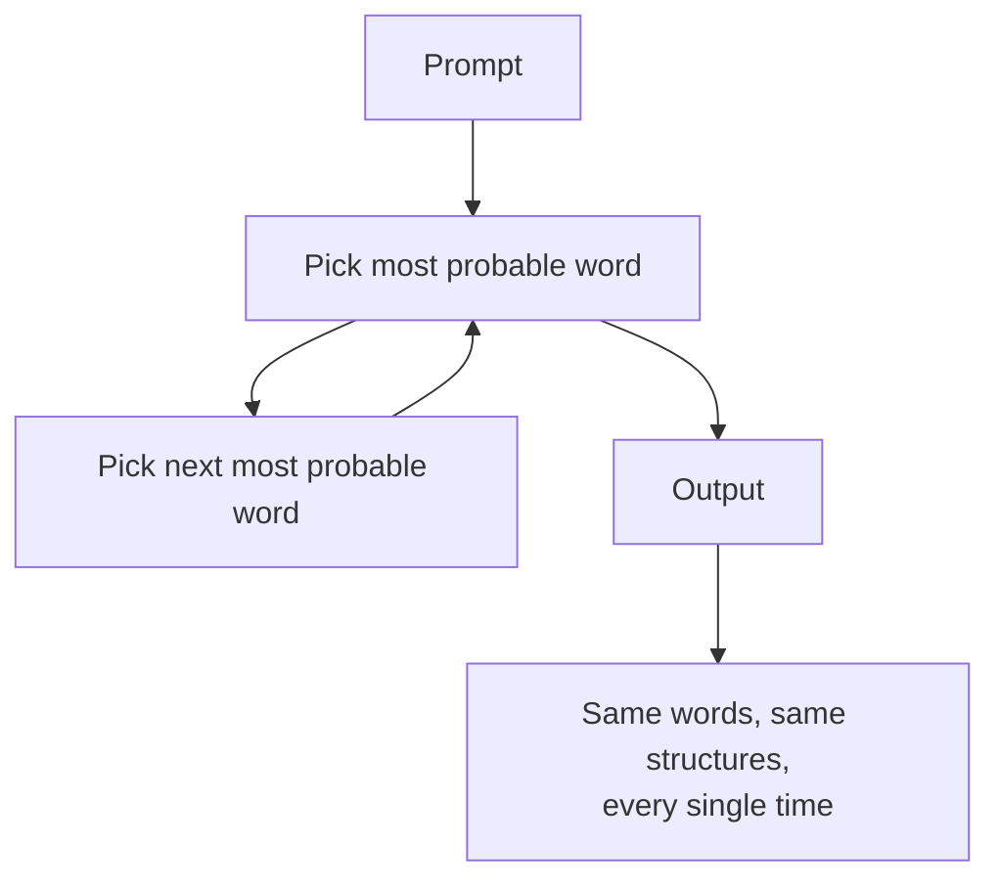
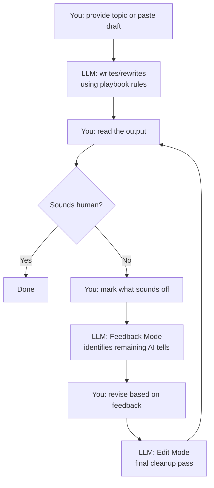

# de-AI-ing

A playbook for making LLM-generated text sound like a real person wrote it.

## What This Is

[`anti-ai-playbook.md`](anti-ai-playbook.md) is a set of rules you feed to an
LLM (Claude, ChatGPT, or anything else) so its output doesn't read like AI
wrote it. It covers:

- Words that scream "AI" and what to use instead
- Sentence and paragraph structures that models default to
- A three-pass rewriting process
- A quality checklist to verify the output
- Signs of actual human writing to preserve

It works in three modes:

- **Draft** — write from scratch without AI tells
- **Edit** — rewrite existing text to sound human
- **Feedback** — review text and flag what still reads as AI

## Why

AI detectors are unreliable. But humans spot AI writing instantly because it
follows predictable patterns: the same words and the same structures every
time. This playbook targets those patterns directly.

Use it for essays, blog posts, emails, LinkedIn content, academic writing, or
anything you need to put your name on.

## How to Use

### ChatGPT

1. Go to **Settings > Personalization > Custom Instructions**
2. Paste the contents of `anti-ai-playbook.md` into the "How would you like
   ChatGPT to respond?" field
3. Every conversation going forward will follow the rules

Alternatively, start a conversation and paste the playbook as your first
message. Then paste or write your content. ChatGPT's memory will carry the
rules across follow-up messages in the same thread.

**Using Memory for voice matching:**
If you've had past conversations where you wrote in your own voice, ChatGPT's
memory may already have a sense of your style. Tell it: "Match my writing voice
from our previous conversations." Combine that with the playbook and it will
both avoid AI patterns and sound like you.

### Claude

1. Go to **Settings > Profile**
2. Paste the contents of `anti-ai-playbook.md` into the "What would you like
   Claude to know about you?" or "How would you like Claude to respond?" section
3. All new conversations will follow the rules

Or paste the playbook at the start of any conversation as context. Claude will
apply it for the duration of that thread.

**Using Projects for persistence:**
Create a Claude Project, add `anti-ai-playbook.md` as a project file, and set
project instructions to "Follow the rules in anti-ai-playbook.md for all
writing tasks." Every conversation in that project will use the playbook
automatically.

### Any LLM

Paste the playbook contents as a system prompt or as the first message in your
conversation. Then provide your text or writing request. The rules are written
as direct instructions to the model and work with any chat-based LLM.

## Why LLMs Sound Like AI

Every time an LLM generates a word, it picks the most statistically probable
next token. That's why all AI text converges to the same vocabulary and
structures. The math picks the safest path every time.

The result: "delve," "crucial," "it's worth noting," tricolons, em dashes,
neat paragraph endings. Not because the LLM thinks these are good. Because
they're statistically safe. This playbook breaks that loop by explicitly
banning the safe defaults and forcing less predictable choices.

## The Iterative Workflow

You stay in control of voice and ideas. The LLM handles pattern detection and
cleanup. Here's how the back-and-forth works:

The loop runs until you're satisfied. Most text needs 1-2 passes. Heavily
AI-generated text might need 3.

## License

CC BY 4.0. Free to use, share, and adapt. Just give credit.

## Sources

Built from research by GPTZero, Wikipedia's "Signs of AI Writing" guide,
academic papers on LLM writing patterns (Reinhart et al., Juzek & Ward, Kobak
et al.), and community resources from Chris Herbert and Sabrina Ramonov. Full
citations in the playbook.
